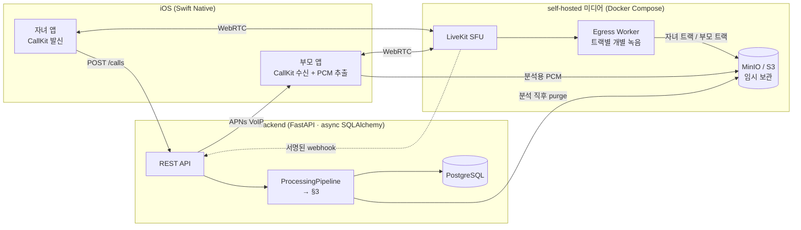
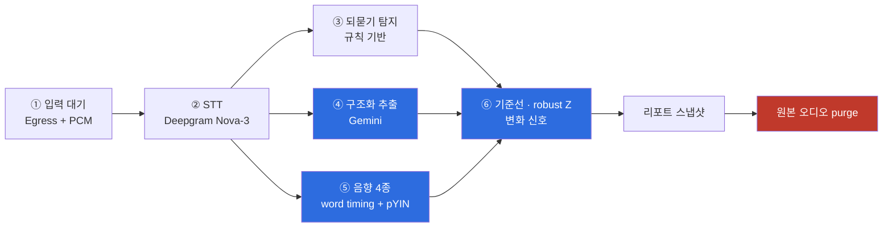

# 콜록(Collog)

> **가족이 이미 하던 전화 한 통을, 부모의 건강 변화 기록으로 바꾼다.**
> 멋쟁이사자처럼 14기 해커톤 · 백엔드 Server

`Python 3.12+` · `FastAPI` · `async SQLAlchemy` · `self-hosted LiveKit` · `Deepgram Nova-3` ·
`Gemini` · `Swift/CallKit (iOS 17+)` · `Docker Compose`


## 1. 무엇을 푸는지

떨어져 사는 부모의 건강 악화는 **한 번의 큰 사건**이 아니라 **몇 주에 걸친 미세한 변화**로 온다.
말이 느려지고, 되묻는 횟수가 늘고, 약을 챙기는 날이 줄어든다. 그런데 이걸 관찰할 수 있는 유일한
접점인 **주 1회 안부 전화는 기록되지 않고 사라진다.**

기존 시니어 헬스케어는 부모에게 **새로운 행동**을 요구한다. 웨어러블을 차거나, 앱을 열거나,
매일 문진에 답해야 한다. 노년층 이탈률이 높은 이유다.

```
기존:  부모가 새 행동을 한다 → 데이터가 쌓인다 → 이탈
콜록:  원래 하던 전화를 한다 → 데이터가 쌓인다 → 이탈할 행동이 없다
```

**절대 하지 않는 것 — 진단 · 위험군 라벨 · 응급도 판단 · 치료 지시.**
슬로건이 아니라 LLM 시스템 지시 · 응답 스키마 · 후처리 validator · 정규식 차단 목록의
**4중으로 코드에 강제한 제약**이다 ([§3.2](#32-gemini-구조화-추출), [§4](#4-숫자를-지어내지-않는다)).

---

## 2. 시스템 아키텍처

핵심은 하나다 — **두 사람의 목소리가 네트워크 계층에서부터 따로 저장되고, 우리 스토리지에
잠깐 머물다, 분석 직후 사라진다.**



**왜 LiveKit Cloud가 아니라 self-hosted인가.** 건강 대화 음성이 우리가 통제하지 못하는 서드파티
스토리지에 남는 상황을 만들지 않기 위해서다. 미디어 서버·Egress·오브젝트 스토리지를 전부 우리
스택에 두면 "분석 직후 폐기"를 **약속이 아니라 코드로** 보장할 수 있다.

**원본은 남지 않는다.** 분석이 끝나면 성공·제외·실패 어느 경로에서든 오디오를 purge하고,
남은 파일은 24시간 뒤 강제 삭제한다. 이때 기준 시각은 `ended_at`이 아니라 **`uploaded_at`**이다 —
`ended_at`은 논리적 통화 시각이라 과거로 조작될 수 있어(replay는 통화를 몇 주 전으로 넣는다),
그걸 기준으로 삼으면 방금 올라온 오디오가 분석 전에 삭제된다. 전사 텍스트도 기본은 로그에 남기지
않고 `LOG_STT_TRANSCRIPT=true`일 때만 출력한다.

**왜 Track Egress인가.** 한 파일에 두 목소리를 섞으면 화자 분리를 STT의 diarization **추정**에
맡겨야 하고, 그 추정이 틀리면 **자녀의 걱정이 부모의 증상으로 기록된다.** 트랙 단위로 분리
녹음하면 화자 라벨이 **네트워크 계층의 사실**이 된다. LLM은 `speaker: PARENT` segment만 근거로
쓸 수 있고, 이 규칙은 후처리에서 다시 검증된다.

---

## 3. AI 파이프라인

통화가 끝나면 **Egress 녹음과 부모 기기의 분석용 PCM이 모두 도착할 때까지 기다린 뒤**
6단계가 순서대로 실행된다. 실패하든 성공하든 마지막은 항상 폐기다.



| 단계 | 구현 | 파일 |
|---|---|---|
| ② STT | Deepgram `nova-3` / `language=ko`. utterance + **word 단위 timing** 보존, 화자별 segment ID 부여 | `app/services/deepgram.py` |
| ③ 되묻기 | 한국어 규칙 detector `repeat-ko-v2`. 3초 병합, 분당 빈도 산출 | `app/services/repeat_detector.py` |
| ④ 구조화 | Gemini structured output. 부모 발화 근거가 있는 4범주만 | `app/services/gemini.py` |
| ⑤ 음향 | 발화 속도 / 휴지 비율 / F0 변동 / 기침 후보 | `app/services/acoustics.py` |
| ⑥ 신호 | ISO 주 단위 median 기준선, MAD robust Z | `app/services/signals.py` |

### 3.1 되묻기 탐지 — 왜 LLM이 아닌가

되묻기(`뭐라고?`, `잘 안 들려`)는 **난청·인지 변화의 관찰 가능한 프록시**다. 여기에 LLM을 쓰지
않은 이유는 셋이다. **설명 가능**(어떤 규칙이 어떤 텍스트에 걸렸는지 그대로 보여준다),
**버전 고정**(`rule_version`을 저장해 규칙이 바뀌어도 과거 기준선과 섞이지 않는다),
**재현 가능**(같은 전사는 항상 같은 결과 — 기준선 비교의 전제 조건).

### 3.2 Gemini 구조화 추출

증상 / 복약 / 활동 / 수면 4범주를 뽑되, **`polarity`(PRESENT·ABSENT·UNCERTAIN)와
`evidenceSegmentIds`를 반드시 함께** 내게 한다. 근거 없는 사실은 애초에 표현할 수 없는 스키마다.
그리고 **전사를 신뢰할 수 없는 입력으로 취급한다** — `"엄마 요즘 기침해?" → "응"`을 기침 증상으로
기록하면 안 된다는 것이 이 도메인의 핵심 함정이고, 프롬프트·스키마·validator가 이를 막는다.

**LLM이 무엇을 말하든, 부모가 실제로 발화한 segment에 붙지 않으면 DB에 들어가지 못한다.**
검증 4단계와 prompt 전문은 [`ai-transcript-design.md`](backend/docs/ai-transcript-design.md)에 있다.

### 3.3 음향 지표 4종

부모 기기의 **분석용 PCM**은 LiveKit `LocalAudioTrack.add(audioRenderer:)`에서 얻는다.
`AVAudioEngine`으로 마이크를 두 번 열지 않는다 — **통화와 완전히 동일한 캡처 스트림**이어야
음향값이 통화 조건을 대표하기 때문이다.

| 지표 | 계산 | 상태 |
|---|---|---|
| `SPEECH_RATE` | Deepgram word timing 기반 음절/분 | ✅ 실기기 측정됨 |
| `PAUSE_RATIO` | segment 내부 300–2000ms gap 비율 | ⚠️ 정의상 항상 0에 가까움 |
| `F0_VARIATION` | `librosa.pyin` 기본주파수의 semitone MAD | ⚠️ 유성음 게이트에 자주 걸림 |
| `COUGH_EVENTS` | HeAR `event_detector_small` ONNX (MobileNet-V3) | 🚫 **의도적으로 비활성** |

음향 런타임은 `librosa.pyin`과 `onnxruntime`만 쓴다 — TensorFlow 없이 돈다.

품질 게이트(길이 5초 이상, 클리핑 1% 미만, 활성 구간 −55 dBFS 이상)를 **하나라도 못 넘기면 값을
만들지 않고 사유 코드와 함께 `UNMEASURABLE`로 저장한다.** 부모 발화가 20초 미만이면 통화 전체를
`ANALYSIS_EXCLUDED`로 처리해 표본 부족이 기준선을 오염시키는 것을 막는다.

### 3.4 개인 내 기준선과 변화 신호

**남과 비교하지 않는다. 어제의 자신과 비교한다.** 발화 속도의 절대값은 사람마다 다르고 정상
범위도 다르다. 의미 있는 건 *이 사람의 평소 대비 변화*다.

```
기준선 = (부모 × 지표 × 시간대) 별로, ISO 주 단위 median을 모은 것

  ANCHOR  : 가장 이른 4주  — "원래 어땠는가"
  ROLLING : 최근 4주       — "최근 어땠는가"

  robust Z = 0.6745 × (현재값 − median) / MAD      임계 |Z| > 1.5
```

| 신호 | 조건 | 문구 예 |
|---|---|---|
| `promoted` (만성 변화) | ANCHOR 대비 유의한 변화가 **4주 연속** | `발화 속도 4주 연속 변화, 처음 대비 −18%` |
| `acute` (급성 변화) | ROLLING 대비 유의 | `발화 속도, 지난달 대비 −22%` |

---

## 4. 숫자를 지어내지 않는다

건강 데이터에서 **틀린 값은 값이 없는 것보다 나쁘다.** `0회`는 "측정 못 했다"가 아니라 "기침이
없었다"로 읽히고, 그 0이 기준선에 쌓이면 MAD가 0이 되어 **이후 실제 기침을 영영 이상치로 잡지
못한다.** 그래서 다음을 아키텍처 불변조건으로 뒀다.

- **모든 지표는 `OK` 또는 `UNMEASURABLE(사유)` 두 상태만 갖는다.** 폴백 기본값이 없다.
- **모델 가중치가 없으면 `MODEL_UNAVAILABLE`, sha256이 다르면 `MODEL_CHECKSUM_MISMATCH`.** 어느 경우에도 숫자를 만들지 않는다.
- **검증되지 않은 detector는 플래그로 잠근다.** `cough_detector_validated=false`인 동안 `COUGH_EVENTS`는 무조건 `UNMEASURABLE(DETECTOR_NOT_VALIDATED)`다.
- **데모 seed도 같은 규칙을 따른다.** 8주 시연 데이터에 기침·휴지·F0는 **넣지 않았다.** 기준선과 변화 신호는 seed가 쓰지 않고 `SignalService`가 실제로 계산한다.
- **보정되지 않은 상수는 코드에 숨기지 않고 설정으로 노출한다.** 코드에 박혀 있으면 그게 틀렸다는 사실조차 드러나지 않는다.

기침 detector를 실제로 껀 판정 과정(임계값·오탐·필요 표본 수)은
[`acoustic-design.md`](backend/docs/acoustic-design.md)에 기록했다.

---

## 5. 검증

```bash
$ uv run ruff check .        # All checks passed!
$ uv run pytest -q           # 64 passed
```

| 대상 | 방법 |
|---|---|
| E2E API | 온보딩 → 초대 → 동의 → 프로필 → 통화 → 이중 업로드 → STT/LLM → 폐기 → 리포트 전 구간 |
| Provider 계약 | Deepgram word timing, Gemini grounding validator·키 redaction, APNs payload, LiveKit Egress·webhook |
| AI 결정성 | prompt · 되묻기 규칙 · **실제 WAV** 음향 4종 · calendar-week 기준선 |
| LLM eval | 더미 fixture 40건 (parent/child/부정/정정/**injection**) — mock 및 실 Gemini 반복 실행 |
| 실기기 | iPhone 2대로 PushKit → CallKit → LiveKit → PCM 업로드 → 분석 완주. `scripts/verify_two_iphone_call.py`가 양 트랙 Egress·양 화자 STT·AI-2·purge를 3분간 추적해 자동 판정한다 |

---

## 6. 알려진 한계

**알려진 한계를 먼저 밝혀둔다.** 전체 목록과 실측 근거는
[`HANDOFF.md` §3](HANDOFF.md)에 있다.

| 한계 | 현재 상태 |
|---|---|
| **음향 4종 중 실제로 값이 나오는 건 발화 속도뿐** | 기침 비활성, 휴지 비율은 정의상 0에 가까움, F0는 유성음 게이트에 자주 걸림. 어떤 음향 수치도 의료 검증값이 아니다 |
| **`acute` 신호는 주 1회 통화로는 구조적으로 안 나온다** | ROLLING 4주에서 현재 통화를 빼면 3표본이라 `COLLECTING`. 버그가 아니라 표본 수 문제이며, 지표 정의 변경이라 임의로 고치지 않았다 |
| **되묻기 탐지 재현율 미측정** | 규칙은 설명 가능하지만 라벨 데이터로 recall을 잰 적이 없다 |
| **전체 40건 실 Gemini eval 미완** | 처리된 7건은 7/7 통과, 나머지 33건은 free-tier quota로 요청 자체가 실패 |
| **양방향 통화 모델 미반영** | 현재는 CHILD→PARENT 고정. 양 참여자 동시 분석은 설계만 완료 |
| **작업 큐가 FastAPI background task** | 운영에는 내구성 있는 큐가 필요 |
| **iOS 토큰이 `UserDefaults`** | 실사용 배포 전 Keychain 이전 필요 |

Gemini 무료 티어 입력은 Google 제품 개선에 사용될 수 있고, Deepgram의 공개 단가는 Model
Improvement Program **참여를 전제한 가격**이다. 따라서 현재 구성은 **해커톤 더미 데이터 전용**이며,
실제 건강정보를 다루려면 데이터 비학습 계약으로 전환해야 한다
([운영비 산정](backend/docs/operating-cost.html)에 단가 출처와 함께 정리).

---

## 7. 직접 실행

**API 키 없이 전체 API 흐름을 볼 수 있다.** 모든 외부 provider는 인터페이스 뒤에 있고 mock
구현이 짝으로 존재해서, `MOCK_EXTERNAL_SERVICES=true`면 LiveKit·Deepgram·Gemini·APNs 없이
전체 흐름이 돈다. 64개 테스트가 외부 호출 0회로 도는 이유이기도 하다. 개발 OTP는 `000000`이다.

```bash
cd backend && cp .env.example .env && uv sync
uv run uvicorn app.main:app --reload --port 8080
```

| | |
|---|---|
| Swagger UI | <http://localhost:8080/docs> |
| 연동 상태 포털 | <http://localhost:8080/team> (비밀값 없는 provider 상태 스냅샷) |
| 헬스체크 | <http://localhost:8080/v1/health> |

8주치 시연 데이터를 넣고 리포트를 보려면:

```bash
uv run python scripts/seed_demo_family.py          # 자녀-부모 가족·동의·프로필
uv run python scripts/seed_narrative_history.py    # 8주 이력 (ANCHOR 4주 + ROLLING 4주)
```

self-hosted 전체 스택(LiveKit + Egress + MinIO + Redis + PostgreSQL)은 한 줄이다.

```bash
docker compose up --build
docker compose exec backend python -m scripts.preflight_two_iphone
```

---

## 8. 문서

| 문서 | 내용 |
|---|---|
| [`HANDOFF.md`](HANDOFF.md) | **단일 기준 문서.** 결정·구현·검증·한계·다음 작업 전부 |
| [`backend/README.md`](backend/README.md) | 실행·배포·환경변수·APNs 발급 절차 |
| [`backend/docs/system-architecture.html`](backend/docs/system-architecture.html) | 구성 요소·포트·통화/분석 흐름 구성도 |
| [`backend/docs/ai-transcript-design.md`](backend/docs/ai-transcript-design.md) | LLM 배치·prompt v2·eval·**grounding validator 4중 검증** |
| [`backend/docs/acoustic-design.md`](backend/docs/acoustic-design.md) | 음향 4종 정의·품질 게이트·**기침 detector를 끈 근거** |
| [`backend/docs/voice-health-model-research.md`](backend/docs/voice-health-model-research.md) | HeAR 판정 근거, 유사 서비스 비교 |
| [`backend/docs/calibration-todo.md`](backend/docs/calibration-todo.md) | 보정되지 않은 상수와 측정 계획 |
| [`backend/docs/schema-management-design.md`](backend/docs/schema-management-design.md) | schema guard와 Alembic의 두 축 |
| [`backend/docs/ios-call-flow.md`](backend/docs/ios-call-flow.md) | Swift PushKit/CallKit/LiveKit/PCM 구현 계약 |
| [`backend/docs/two-iphone-e2e.md`](backend/docs/two-iphone-e2e.md) | iPhone 2대 E2E 체크리스트와 장애 분리 |
| [`backend/docs/operating-cost.html`](backend/docs/operating-cost.html) | 공식 단가 기반 규모별 운영비 산정 |

---

## 9. 팀

| 담당 | 영역 |
|---|---|
| 곽용진 | AI 파이프라인 설계·구현 (STT · LLM grounding · 음향 · 기준선), 전체 아키텍처 구현, 운영비 분석 |
| 문효재 | 백엔드 API 및 아키텍처 설계, 배포·클라우드 서버 구성, schema guard 및 DB 검증 |
| 심재현 | iOS 전체 (PushKit · CallKit · LiveKit · 화면) 인증, 온디바이스 PCM 캡처 구현, HeAR 기침 detector 구현 |


---
